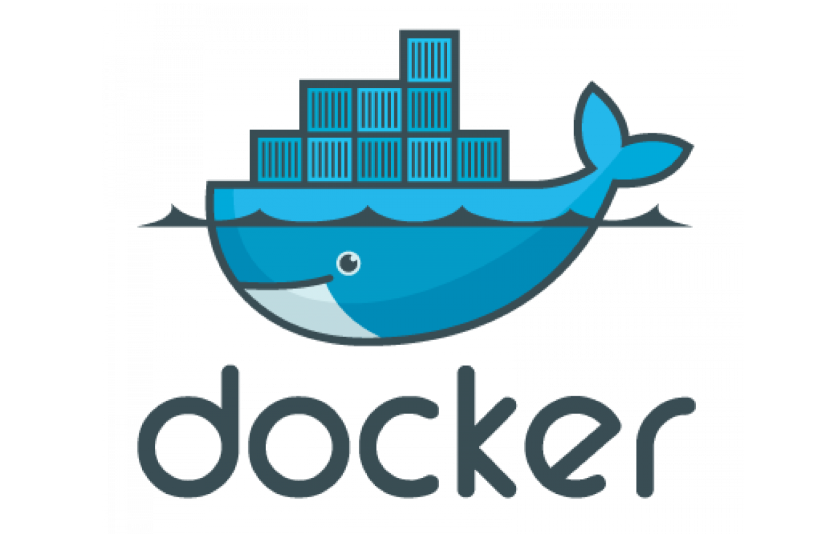

# Covid19_Taiwan_Dashboard_Docker_Compose

## Introduction
This is the docker-compose version of my previous projects: <a href='https://github.com/BurgerWu/airflow_covid19_tw'>airflow_covid19_tw</a> and <a href='https://github.com/BurgerWu/Covid19_Django_Webapp'>Covid19_Django_Webapp</a>.
Instead of making an online website, this project provides a solution to deploy the website in a easy way on any platform any machine as long as there is docker engine installed. This tutorial is based on Windows Docker desktop.

- **airflow_covid19_tw:**<br>
Apply apache airflow to collect and write covid19 data of Taiwan into local MYSQL database. The data includes cases , suspects and vaccination statistics.

- **Covid19_Django_Webapp:**<br>
Apply Django framework to demonstrate transformed covid19 Taiwan data from previous project. This project contains a one page webpage containing interactive Dash Plotly visualizations.

## Files and Directory
### Directories:
- **Covid19_Django_Webapp:** Contains files required for django website

- **airflow_covid19_tw:** Contains files required for Apache airflow system

### Files:
- **af_mysql.Dockerfile:** Dockerfile for mysql container image
- **airflow.Dockerfile:** Base image for apache airflow
- **cases.sql:** SQL script for initiating covid19 cases table
- **django.Dockerfile:** Dockerfile for Django framework
- **django_requirements.txt:** Requirements for Django environment
- **mysql_setting.sql:** A startup script for MYSQL initiation
- **source.sql:** SQL command line script for initiating MYSQL databases
- **suspects.sql:** SQL script for initiating covid19 suspects table
- **vacc.sql:** SQL script for initiating covid19 vaccination table

## How to deploy this project
- **Download this project via Github:**<br>
You may git clone this project or download zip file directly from Github

- **Have docker engine install on your machine:**<br>
Check out <a href='https://www.docker.com/products/docker-desktop/'>Docker official site </a> for more information.<br>
***Try to allocate some more resources to docker if possible, some initialization process requires relatively high memory usage***


- **Install docker-compose:**<br>
Check <a href='https://docs.docker.com/compose/install/'>here </a>for more information. If you already install docker desktop, docker-compose should come along with the installation.
This is the combination docker version of my previous project airflow_covid19_tw and Covid19_Django_Webapp.

- **Run docker-compose command**<br>
Direct your working directory or specify the full path to which this project was downloaded. Run the following command. This will create required images according to yaml file specified and up the containers.<br>
```docker-compose -f path_to_docker_compose_yaml up ```<br>

- **You may need to run last command twice for unknown reason**<br>
For some unknown reason(probably cause by docker up sequence won't wait till the dependent container be fully ready), the initiation of airflow container will fail for the first time, and you may need to run the same command again so that the docker system will be successfully up. You may see error message like below


After running ```docker-compose -f path_to_docker_compose_yaml up ```  again, you should be able to have all containers ready. Note that the airflow_init container will only run once thus will not be always active after finishing initiation.


- **Create mysql_conn connection in Apache airflow webpage**
1. Type **localhost:8080** in your local browser
2. Go to Admin->Connections
3. Click + sign on top left corner to add new connection
4. Configure the MySQL connection as below(password is password)


- **Initiate covid19 databases**<br>
There are two ways to perform initialization of covid19 databases. The first is through Apache airflow webpage, the other is run MySQL script directly.<br>

**Apache airflow web interface**
1. Type **localhost:8080** in your local browser
2. Type user name and password if requested. (username: aritek, password: password)
3. Unpause the initiate_database dag
4. Trigger the initiate_database dag

*It could take pretty long for the initialization because the dag will create data from nothing and there is almost 3 year data to process.*

**Run MySQL script directly(Data updated to 2022/10/31)**
1. Open CLI of container covid19_docker_mysql_1
2. Type ```mysql -u aritek -p```
3. Type ```password``` if requested for password, then you are now in mysql CLI

4. Run ```source source.sql``` to run three subsequent scripts for three tables. It could take some time.
<br>
*This method should be faster since it does not require data fetching and transforming like previous method. However, the current script was updated to 2022/10/31 instead of most current data. If you wish to see latest data, please choose first method. If you just need to see how the deployed website looks like, take method 2.*

- **Restart the Django container**<br>
When the Django container was first created and activated, there is no data in the database, making the website not workable. After the initialization of databases was done, restart the Django container, and type **localhost:8000** in your browser. The website should now be available for you!<br>


- **Unpause the updage dags and trigger them to have daily update**
If you need the data to be updated on a daily basis, unpause the three update dags and trigger(run right away) or wait til the execution time is reached.

# Conclusion
In this project, we successfully turn our former projects into one docker-compose that everyone can carry around through any platform running Docker-Compose. The Apache airflow is responsible for data acquisition and update task while Django framework fulfills the visualization of the data. If you encounter some problems during usage(like frequent restarting or auto termination), try to allocate some more resources(especially memory) to docker.

There are some Medium articles related to this work for you to reference.
- <a href='https://blog.devops.dev/two-major-ways-to-bulk-import-data-to-mysql-database-4621d482f8f7'>Two Major Ways to Bulk Import Data to MySQL Database</a>
- <a href='https://blog.devgenius.io/implement-interactive-plotly-dash-plot-within-your-django-project-66f3f4fbef94'>Implement Interactive Plotly Dash Plot Within Your Django Project</a>
- <a href='https://burgercewu.medium.com/taiwan-covid19-dashboard-data-engineering-project-b557f22341de'>Taiwan Covid19 Dashboard Data Engineering Project</a>
- <a href='https://python.plainenglish.io/apache-airflow-how-to-correctly-setup-custom-plugins-2f80fe5e3dbe'>How to Correctly Setup Custom Plugins of Apache Airflow</a>

Power BI online report of this project can be found here!<br>
<a href='https://app.powerbi.com/view?r=eyJrIjoiYTQyY2Q3NmQtZjYwYy00NGE0LTljYjUtYTU0YmRkZDc5MGNmIiwidCI6Ijk1Y2U2MTk5LWNhMzYtNDgyMC04N2MzLWQ1NDBjODYwMjcwYyIsImMiOjEwfQ%3D%3D&pageName=ReportSection'>Power BI of Covid19 Taiwan DashBOard Project</a>

Finally, the legacy repository for covid19 dashboard project
- <a href='https://github.com/BurgerWu/airflow_covid19_tw'>airflow_covid19_tw</a>
- <a href='https://github.com/BurgerWu/Covid19_Django_Webapp'>Covid19_Django_Webapp</a>
